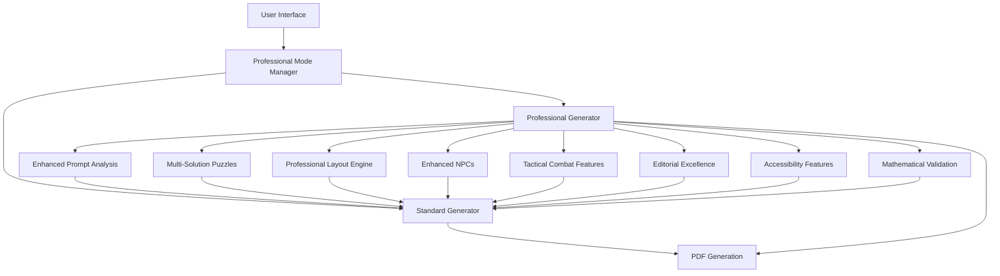
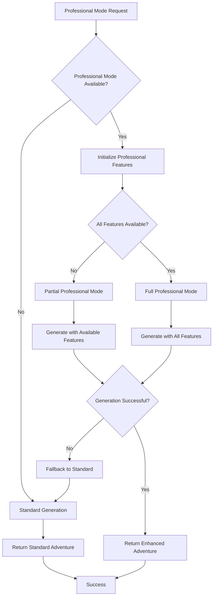

# Professional Mode Integration - Design Document

## Overview

This design implements a safe, backwards-compatible Professional Mode system that enhances Arcanum Scribe's adventure generation capabilities without disrupting existing functionality. The system uses a layered architecture approach where professional features operate as an optional enhancement layer over the existing stable foundation.

## Architecture

### Core Architecture Principles

1. **Non-Disruptive Integration**: Professional features are additive, never replacing existing functionality
2. **Graceful Degradation**: System continues to work even if professional features fail
3. **Feature Toggle Architecture**: Individual professional features can be enabled/disabled independently
4. **Performance Isolation**: Professional features don't impact standard generation performance
5. **Safe Fallback**: Automatic fallback to standard mode if professional mode encounters issues

### System Architecture Diagram



## Components and Interfaces

### 1. Professional Mode Manager

**Purpose**: Central orchestrator for professional features
**Location**: `src/lib/professional-mode-manager.ts`

```typescript
interface ProfessionalModeManager {
  // Core management
  initialize(): Promise<boolean>
  isAvailable(): boolean
  enable(): void
  disable(): void
  
  // Feature management
  updateFeatures(features: Partial<ProfessionalFeatures>): void
  getConfig(): ProfessionalModeConfig
  
  // Enhancement processing
  enhanceAdventure(adventure: GeneratedAdventure, prompt: AdventurePrompt): Promise<ProfessionalEnhancement>
  
  // Quality assessment
  calculateQualityMetrics(enhancement: ProfessionalEnhancement): QualityMetrics
  determineProfessionalGrade(metrics: QualityMetrics): ProfessionalGrade
}
```

### 2. Professional Enhancement Layer

**Purpose**: Wrapper that contains both original and enhanced content
**Location**: `src/lib/types/professional.ts`

```typescript
interface ProfessionalEnhancement {
  originalAdventure: GeneratedAdventure
  professionalFeatures: {
    enhancedPromptAnalysis?: EnhancedPromptAnalysis
    multiSolutionPuzzles?: MultiSolutionPuzzle[]
    professionalLayout?: ProfessionalLayout
    enhancedNPCs?: EnhancedNPC[]
    tacticalCombat?: TacticalCombatFeature[]
    editorialEnhancements?: EditorialEnhancement[]
    accessibilityFeatures?: AccessibilityFeature[]
    validationReport?: ValidationReport
  }
  qualityMetrics: QualityMetrics
  professionalGrade: ProfessionalGrade
  processingTime: number
  featuresApplied: string[]
}
```

### 3. Feature Integration Adapters

**Purpose**: Bridge between existing professional modules and new architecture
**Location**: `src/lib/adapters/`

Each professional module gets an adapter that:
- Handles initialization and error checking
- Provides consistent interface
- Manages feature-specific configuration
- Implements graceful degradation

### 4. UI Enhancement Components

**Purpose**: Professional mode controls and feedback
**Location**: `src/components/professional/`

Components:
- `ProfessionalModeToggle.tsx` - Main toggle switch
- `ProfessionalFeatureConfig.tsx` - Feature configuration panel
- `QualityMetricsDisplay.tsx` - Quality score visualization
- `ProfessionalPreview.tsx` - Enhanced content preview

### 5. Safe Integration Service

**Purpose**: Manages safe integration with existing generation flow
**Location**: `src/services/professional-integration.ts`

```typescript
interface ProfessionalIntegrationService {
  // Safe generation
  generateWithProfessionalMode(
    prompt: AdventurePrompt, 
    config: ProfessionalModeConfig
  ): Promise<GeneratedAdventure | ProfessionalEnhancement>
  
  // Fallback handling
  handleProfessionalModeFailure(error: Error, prompt: AdventurePrompt): Promise<GeneratedAdventure>
  
  // Feature validation
  validateProfessionalFeatures(): Promise<FeatureValidationResult>
}
```

## Data Models

### Professional Mode Configuration

```typescript
interface ProfessionalModeConfig {
  enabled: boolean
  features: {
    enhancedPromptAnalysis: boolean
    multiSolutionPuzzles: boolean
    professionalLayout: boolean
    enhancedNPCs: boolean
    tacticalCombat: boolean
    editorialExcellence: boolean
    accessibilityFeatures: boolean
    mathematicalValidation: boolean
  }
  qualityTarget: 'standard' | 'professional' | 'premium'
  performanceMode: 'balanced' | 'quality' | 'speed'
  fallbackBehavior: 'graceful' | 'strict'
}
```

### Quality Metrics System

```typescript
interface QualityMetrics {
  contentQuality: number        // 0-100: Content depth and creativity
  mechanicalAccuracy: number    // 0-100: Rules accuracy and balance
  editorialStandards: number    // 0-100: Writing quality and formatting
  userExperience: number        // 0-100: Usability and accessibility
  professionalReadiness: number // 0-100: Publication readiness
  overallScore: number          // Weighted average
  processingTime: number        // Generation time in milliseconds
  featuresSuccessRate: number   // Percentage of features that applied successfully
}
```

### Enhanced Adventure Structure

```typescript
interface EnhancedAdventure extends GeneratedAdventure {
  professionalMetadata: {
    qualityGrade: ProfessionalGrade
    featuresApplied: string[]
    processingTime: number
    enhancementVersion: string
  }
  enhancedContent: {
    multiSolutionElements?: MultiSolutionPuzzle[]
    tacticalCombatScenarios?: TacticalCombatFeature[]
    enhancedNPCs?: EnhancedNPC[]
    editorialEnhancements?: EditorialEnhancement[]
    accessibilityFeatures?: AccessibilityFeature[]
  }
  qualityReport: QualityMetrics
}
```

## Error Handling

### Graceful Degradation Strategy

1. **Feature-Level Fallback**: If individual features fail, continue with remaining features
2. **Module-Level Fallback**: If entire professional modules fail, continue with standard generation
3. **System-Level Fallback**: If professional mode completely fails, seamlessly switch to standard mode
4. **User Communication**: Clear messaging about what features are active/inactive

### Error Handling Flow



### Error Types and Responses

1. **Initialization Errors**: Log warning, disable professional mode, continue with standard
2. **Feature Errors**: Log error, disable specific feature, continue with remaining features
3. **Generation Errors**: Log error, attempt fallback, if fallback fails, return error to user
4. **Performance Errors**: Log warning, switch to performance mode, continue generation

## Testing Strategy

### Unit Testing

- **Professional Mode Manager**: Test all configuration and feature management functions
- **Feature Adapters**: Test each professional feature adapter independently
- **Integration Service**: Test safe integration and fallback mechanisms
- **Quality Metrics**: Test quality calculation algorithms

### Integration Testing

- **End-to-End Professional Generation**: Test complete professional mode workflow
- **Fallback Scenarios**: Test all fallback mechanisms work correctly
- **Performance Testing**: Ensure professional mode doesn't degrade standard performance
- **Feature Combinations**: Test various combinations of enabled/disabled features

### User Acceptance Testing

- **Toggle Functionality**: Test professional mode toggle works correctly
- **Quality Improvements**: Verify users can see quality improvements
- **Performance Impact**: Ensure acceptable generation times
- **Error Handling**: Test user experience when errors occur

## Performance Considerations

### Performance Optimization Strategies

1. **Lazy Loading**: Load professional modules only when needed
2. **Caching**: Cache professional feature results where appropriate
3. **Parallel Processing**: Run independent professional features in parallel
4. **Resource Management**: Monitor memory usage and cleanup resources
5. **Performance Monitoring**: Track generation times and feature performance

### Performance Targets

- **Standard Mode**: No performance impact (0% overhead)
- **Professional Mode**: Maximum 50% increase in generation time
- **Feature Loading**: Professional features load in <2 seconds
- **Memory Usage**: Professional mode uses <100MB additional memory
- **Error Recovery**: Fallback to standard mode in <1 second

## Security Considerations

### Security Measures

1. **Input Validation**: Validate all professional mode configurations
2. **Resource Limits**: Prevent professional features from consuming excessive resources
3. **Error Information**: Don't expose sensitive system information in error messages
4. **Feature Isolation**: Professional features can't access sensitive system resources
5. **Audit Logging**: Log professional mode usage for monitoring

### Security Implementation

- **Configuration Validation**: Validate all professional mode settings before applying
- **Resource Monitoring**: Monitor CPU, memory, and network usage
- **Error Sanitization**: Sanitize error messages before showing to users
- **Feature Sandboxing**: Run professional features in isolated contexts
- **Access Control**: Ensure professional features respect user permissions

## Migration Strategy

### Phase 1: Foundation (Week 1)
- Implement Professional Mode Manager
- Create basic UI toggle
- Implement safe integration service
- Add error handling and fallback mechanisms

### Phase 2: Feature Integration (Week 2)
- Create feature adapters for existing professional modules
- Implement quality metrics system
- Add professional enhancement data structures
- Test individual feature integration

### Phase 3: UI Enhancement (Week 3)
- Implement professional mode UI components
- Add quality metrics display
- Create feature configuration panel
- Implement professional content preview

### Phase 4: Testing and Optimization (Week 4)
- Comprehensive testing of all features
- Performance optimization
- User acceptance testing
- Documentation and training materials

### Rollback Plan

If issues arise during deployment:
1. **Immediate**: Disable professional mode toggle (users see standard mode only)
2. **Short-term**: Remove professional mode components, keep standard functionality
3. **Long-term**: Revert to previous stable version if necessary

## Monitoring and Analytics

### Key Metrics to Track

1. **Usage Metrics**:
   - Professional mode adoption rate
   - Feature usage patterns
   - Quality score distributions
   - Generation time comparisons

2. **Performance Metrics**:
   - Professional mode success rate
   - Feature failure rates
   - Fallback frequency
   - System resource usage

3. **Quality Metrics**:
   - User satisfaction with professional content
   - Quality score improvements
   - Feature effectiveness ratings
   - Error rates and types

### Monitoring Implementation

- **Real-time Dashboards**: Monitor professional mode health and performance
- **Alerting**: Alert on high error rates or performance degradation
- **User Feedback**: Collect user feedback on professional mode experience
- **A/B Testing**: Compare standard vs professional mode user satisfaction

This design ensures a safe, professional-grade integration that enhances user experience while maintaining system stability and reliability.