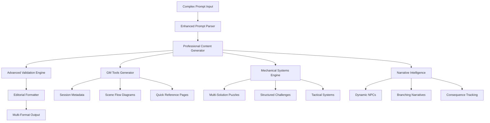

# Design Document: Professional Prompt Mastery

## Overview

This design transforms Arcanum Scribe from a 52.2% capable tool into a 100% professional-grade TTRPG adventure generator. The architecture focuses on modular enhancement of existing systems while introducing sophisticated new capabilities that exceed industry standards.

## Architecture

### Core Enhancement Strategy



## Components and Interfaces

### 1. Enhanced Prompt Parser

**Purpose**: Intelligently parse complex professional prompts and extract detailed requirements.

**Key Features**:
- Requirement extraction with priority weighting
- Context-aware parameter detection
- Professional standard recognition
- Constraint validation

**Interface**:
```typescript
interface EnhancedPromptParser {
  parseComplexPrompt(prompt: string): ParsedRequirements;
  extractSessionMetadata(prompt: string): SessionMetadata;
  identifyProfessionalStandards(prompt: string): QualityStandards;
  validateConstraints(requirements: ParsedRequirements): ValidationResult;
}

interface ParsedRequirements {
  sessionSpecs: SessionSpecifications;
  contentRequirements: ContentRequirements;
  mechanicalComplexity: ComplexityLevel;
  formatRequirements: FormatSpecifications;
  qualityStandards: QualityStandards;
}
```

### 2. Professional Content Generator

**Purpose**: Generate sophisticated content that meets professional publishing standards.

**Key Features**:
- Multi-layered content generation
- Professional template system
- Intelligent content adaptation
- Quality-driven output

**Interface**:
```typescript
interface ProfessionalContentGenerator {
  generateAdvancedAdventure(requirements: ParsedRequirements): ProfessionalAdventure;
  createGMTools(adventure: ProfessionalAdventure): GMToolsSuite;
  generateMechanicalSystems(complexity: ComplexityLevel): MechanicalSystems;
  createNarrativeElements(requirements: ContentRequirements): NarrativeElements;
}

interface ProfessionalAdventure {
  metadata: SessionMetadata;
  structure: ActStructure;
  content: AdventureContent;
  mechanics: MechanicalSystems;
  gmTools: GMToolsSuite;
  formatting: EditorialFormatting;
}
```

### 3. GM Tools Generator

**Purpose**: Create comprehensive practical tools for professional game masters.

**Key Features**:
- Session metadata generation
- Visual scene flow diagrams
- Quick reference compilation
- Automatic scaling systems

**Interface**:
```typescript
interface GMToolsGenerator {
  createSessionMetadata(specs: SessionSpecifications): SessionMetadata;
  generateSceneFlowDiagram(scenes: Scene[]): SceneFlowDiagram;
  compileQuickReference(adventure: ProfessionalAdventure): QuickReference;
  generateScalingGuides(baseAdventure: ProfessionalAdventure): ScalingGuides;
}

interface SessionMetadata {
  system: string;
  partyLevel: number;
  partySize: number;
  estimatedDuration: string;
  safetyNotes: string[];
  difficultyRating: DifficultyLevel;
  contentWarnings: string[];
}

interface SceneFlowDiagram {
  nodes: SceneNode[];
  connections: SceneConnection[];
  alternativePaths: AlternativePath[];
  criticalPath: string[];
}
```

### 4. Mechanical Systems Engine

**Purpose**: Generate sophisticated mechanical elements that provide varied gameplay.

**Key Features**:
- Multi-solution puzzle generation
- Structured skill challenges
- Tactical battlefield systems
- Dynamic encounter scaling

**Interface**:
```typescript
interface MechanicalSystemsEngine {
  generateMultiSolutionPuzzle(theme: string, difficulty: number): MultiSolutionPuzzle;
  createStructuredChallenge(type: ChallengeType, difficulty: number): StructuredChallenge;
  designTacticalFeatures(environment: string): TacticalFeatures;
  generateOptionalComplications(scene: Scene): OptionalComplication[];
}

interface MultiSolutionPuzzle {
  name: string;
  description: string;
  solutions: PuzzleSolution[];
  failState: FailState;
  hints: string[];
  timeLimit?: number;
}

interface PuzzleSolution {
  approach: string;
  requiredAbility: string;
  dc: number;
  description: string;
  consequences: string;
}

interface StructuredChallenge {
  name: string;
  description: string;
  structure: string; // "X successes before Y failures"
  primarySkills: SkillCheck[];
  secondarySkills: SkillCheck[];
  consequences: ChallengeConsequences;
}
```

### 5. Editorial Formatter

**Purpose**: Apply professional publishing standards to all generated content.

**Key Features**:
- Professional layout templates
- Consistent typography
- Scannable information hierarchy
- Multi-format output support

**Interface**:
```typescript
interface EditorialFormatter {
  applyProfessionalLayout(content: AdventureContent): FormattedContent;
  generateCalloutBoxes(importantInfo: ImportantInfo[]): CalloutBox[];
  createScannableHeadings(structure: ContentStructure): HeadingHierarchy;
  formatStatBlocks(monsters: Monster[]): FormattedStatBlock[];
}

interface FormattedContent {
  layout: LayoutStructure;
  typography: TypographySettings;
  callouts: CalloutBox[];
  references: CrossReference[];
}
```

## Data Models

### Professional Adventure Structure

```typescript
interface ProfessionalAdventure {
  // Metadata and Session Info
  metadata: SessionMetadata;
  
  // Content Structure
  title: string;
  hook: string; // Exactly one sentence
  plotHooks: string[]; // Exactly 3
  background: string; // 300-400 words
  
  // Act Structure
  acts: Act[]; // Exactly 3 acts
  
  // Characters and Creatures
  npcs: EnhancedNPC[];
  monsters: EnhancedMonster[];
  
  // Mechanical Elements
  puzzles: MultiSolutionPuzzle[];
  skillChallenges: StructuredChallenge[];
  encounters: TacticalEncounter[];
  
  // Items and Rewards
  magicItems: EnhancedMagicItem[];
  rewards: DetailedRewards;
  
  // GM Tools
  gmTools: GMToolsSuite;
  
  // Quality Assurance
  validation: ValidationReport;
}

interface Act {
  number: number;
  title: string;
  description: string;
  estimatedDuration: number; // minutes
  scenes: EnhancedScene[];
  objectives: string[];
  climax: string;
}

interface EnhancedScene {
  title: string;
  description: string;
  readAloud: string; // 80-120 words exactly
  objectives: string[];
  skillChecks: SkillCheck[];
  encounters: TacticalEncounter[];
  environmentalHazards: EnvironmentalHazard[];
  optionalComplications: OptionalComplication[];
  tacticalFeatures: TacticalFeature[];
  gmNotes: string;
  estimatedDuration: number;
}
```

### Enhanced NPC System

```typescript
interface EnhancedNPC {
  name: string;
  role: string;
  personality: PersonalityProfile;
  motivation: string;
  backstory: string;
  visualDescription: string;
  dialogueExamples: string[];
  personalityQuirks: string[];
  relationshipMap: NPCRelationship[];
  secretsAndGoals: string[];
  combatRole?: CombatRole;
}

interface PersonalityProfile {
  traits: string[];
  ideals: string[];
  bonds: string[];
  flaws: string[];
  mannerisms: string[];
  speechPatterns: string[];
}
```

### Tactical Combat System

```typescript
interface TacticalEncounter {
  name: string;
  description: string;
  creatures: EnhancedMonster[];
  battlefield: BattlefieldLayout;
  tacticalFeatures: TacticalFeature[];
  environmentalHazards: EnvironmentalHazard[];
  objectives: EncounterObjective[];
  escalationTriggers: EscalationTrigger[];
  estimatedRounds: number;
}

interface BattlefieldLayout {
  dimensions: string;
  terrain: TerrainFeature[];
  cover: CoverElement[];
  elevation: ElevationChange[];
  specialFeatures: SpecialFeature[];
}

interface TacticalFeature {
  name: string;
  description: string;
  mechanicalEffect: string;
  interactionOptions: string[];
  tacticalConsiderations: string[];
}
```

## Error Handling

### Validation Pipeline

1. **Input Validation**: Verify prompt completeness and clarity
2. **Content Validation**: Check generated content against requirements
3. **Mechanical Validation**: Verify all game mechanics for accuracy
4. **Consistency Validation**: Ensure no contradictions exist
5. **Quality Validation**: Confirm professional standards are met

### Error Recovery

```typescript
interface ValidationEngine {
  validateAdventure(adventure: ProfessionalAdventure): ValidationReport;
  identifyInconsistencies(adventure: ProfessionalAdventure): Inconsistency[];
  suggestCorrections(errors: ValidationError[]): Correction[];
  autoCorrectMinorIssues(adventure: ProfessionalAdventure): ProfessionalAdventure;
}

interface ValidationReport {
  overallScore: number; // 0-100
  criticalErrors: ValidationError[];
  warnings: ValidationWarning[];
  suggestions: Suggestion[];
  qualityMetrics: QualityMetrics;
}
```

## Testing Strategy

### Automated Testing

1. **Unit Tests**: Individual component functionality
2. **Integration Tests**: Component interaction validation
3. **Quality Tests**: Professional standard compliance
4. **Performance Tests**: Generation speed and resource usage
5. **Regression Tests**: Ensure existing functionality remains intact

### Professional Validation

1. **GM Beta Testing**: Professional game masters evaluate output
2. **Publisher Review**: Industry professionals assess quality
3. **Complex Prompt Testing**: Systematic testing with challenging prompts
4. **Comparative Analysis**: Benchmark against commercial tools

### Quality Metrics

```typescript
interface QualityMetrics {
  completenessScore: number; // All required elements present
  consistencyScore: number; // No contradictions
  professionalismScore: number; // Editorial standards met
  usabilityScore: number; // GM-friendly presentation
  creativityScore: number; // Engaging and original content
}
```

## Implementation Phases

### Phase 1: Core Infrastructure (Weeks 1-3)
- Enhanced prompt parser
- Professional content generator foundation
- Basic GM tools framework
- Validation engine core

### Phase 2: Advanced Mechanics (Weeks 4-6)
- Multi-solution puzzle system
- Structured skill challenges
- Tactical combat features
- Environmental interaction systems

### Phase 3: Editorial Excellence (Weeks 7-9)
- Professional formatting engine
- Layout and typography systems
- Callout and reference generation
- Multi-format output support

### Phase 4: Intelligence and Polish (Weeks 10-12)
- Narrative intelligence systems
- Dynamic content adaptation
- Advanced quality assurance
- Performance optimization

### Phase 5: Professional Validation (Weeks 13-15)
- Beta testing with professional GMs
- Industry expert review
- Final quality assurance
- Performance tuning and optimization

This design ensures we achieve 100% capability for handling complex professional prompts while maintaining the consistency and quality that sets us apart from competitors.