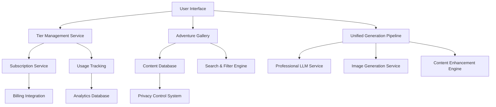

# Unified Tier System - Design Document

## Overview

This design document outlines the implementation of a unified professional-quality adventure generation system with a three-tier subscription model. The design maintains Arcanum Scribe's existing visual identity while introducing new components for tier management, gallery browsing, and content privacy controls.

## Architecture

### System Architecture



### Data Flow

1. **User Authentication** → Tier Validation → Feature Access Control
2. **Adventure Generation** → Professional Pipeline → Privacy Setting → Storage/Publication
3. **Gallery Browsing** → Search/Filter → Content Retrieval → Display
4. **Usage Tracking** → Real-time Updates → Limit Enforcement → Upgrade Prompts

## Components and Interfaces

### 1. Tier Management System

#### TierProvider Component
```typescript
interface TierConfig {
  name: 'explorer' | 'creator' | 'master';
  displayName: string;
  price: number;
  features: TierFeatures;
  limits: TierLimits;
  styling: TierStyling;
}

interface TierFeatures {
  canGenerate: boolean;
  generationsPerMonth: number;
  privateAdventures: number;
  priorityQueue: boolean;
  advancedExports: boolean;
  analytics: boolean;
}

interface TierStyling {
  badgeColor: string;
  accentColor: string;
  iconComponent: React.ComponentType;
  gradientClass: string;
}
```

#### Visual Design System
```scss
// Tier-specific color palette
$tier-explorer: #64748b;    // Slate-500 (existing muted)
$tier-creator: #8b5cf6;     // Violet-500 (existing primary)
$tier-master: #f59e0b;      // Amber-500 (existing accent)

// Tier badges
.tier-badge {
  &--explorer {
    @apply bg-slate-100 text-slate-700 border-slate-300;
  }
  
  &--creator {
    @apply bg-violet-100 text-violet-700 border-violet-300;
  }
  
  &--master {
    @apply bg-amber-100 text-amber-700 border-amber-300;
  }
}

// Tier cards
.tier-card {
  &--explorer {
    @apply border-slate-200 hover:border-slate-300;
  }
  
  &--creator {
    @apply border-violet-200 hover:border-violet-300 shadow-violet-100;
  }
  
  &--master {
    @apply border-amber-200 hover:border-amber-300 shadow-amber-100;
  }
}
```

### 2. Adventure Gallery System

#### GalleryInterface Component
```typescript
interface AdventureCard {
  id: string;
  title: string;
  description: string;
  creator: CreatorInfo;
  metadata: AdventureMetadata;
  stats: AdventureStats;
  thumbnail: string;
  tags: string[];
  privacy: 'public' | 'private';
}

interface CreatorInfo {
  id: string;
  displayName: string;
  tier: TierConfig['name'];
  avatar?: string;
  verified: boolean;
}

interface AdventureStats {
  views: number;
  downloads: number;
  rating: number;
  ratingCount: number;
  createdAt: Date;
}
```

#### Gallery Layout Design
```tsx
// Main Gallery Layout
<div className="gallery-container">
  <GalleryHeader />
  <GalleryFilters />
  <GalleryGrid>
    {adventures.map(adventure => (
      <AdventureCard key={adventure.id} adventure={adventure} />
    ))}
  </GalleryGrid>
  <GalleryPagination />
</div>

// Adventure Card Design
<Card className="adventure-card group hover:shadow-lg transition-all duration-300">
  <div className="relative">
    
    <TierBadge tier={adventure.creator.tier} className="absolute top-2 right-2" />
  </div>
  
  <CardContent className="p-4">
    <div className="flex items-start justify-between mb-2">
      <h3 className="font-semibold text-lg line-clamp-2">{adventure.title}</h3>
      <StarRating rating={adventure.stats.rating} size="sm" />
    </div>
    
    <p className="text-muted-foreground text-sm line-clamp-3 mb-3">
      {adventure.description}
    </p>
    
    <div className="flex items-center justify-between">
      <CreatorInfo creator={adventure.creator} />
      <AdventureStats stats={adventure.stats} />
    </div>
  </CardContent>
</Card>
```

### 3. Unified Generation Interface

#### Simplified Generation Flow
```tsx
// Remove professional mode toggles, streamline interface
<div className="generation-workspace">
  <WorkspaceHeader>
    <h1>Adventure Workshop</h1>
    <TierUsageIndicator />
  </WorkspaceHeader>
  
  <AdventureWizard 
    onComplete={handleGeneration}
    tierLimits={userTier.limits}
  />
  
  {isGenerating && (
    <GenerationProgress 
      steps={PROFESSIONAL_STEPS}
      currentStep={currentStep}
      progress={progress}
    />
  )}
</div>

// Tier Usage Indicator
<div className="tier-usage-card">
  <div className="flex items-center justify-between">
    <div>
      <TierBadge tier={userTier.name} />
      <p className="text-sm text-muted-foreground">
        {remainingGenerations} of {userTier.limits.generationsPerMonth} remaining
      </p>
    </div>
    
    {remainingGenerations < 3 && (
      <Button variant="outline" onClick={handleUpgrade}>
        Upgrade
      </Button>
    )}
  </div>
  
  <Progress 
    value={(usedGenerations / userTier.limits.generationsPerMonth) * 100}
    className="mt-2"
  />
</div>
```

### 4. Privacy Control System

#### Privacy Settings Interface
```tsx
<div className="privacy-controls">
  <div className="flex items-center justify-between">
    <div>
      <h3 className="font-medium">Adventure Visibility</h3>
      <p className="text-sm text-muted-foreground">
        Control who can see and access this adventure
      </p>
    </div>
    
    <Select value={privacy} onValueChange={setPrivacy}>
      <SelectTrigger className="w-32">
        <SelectValue />
      </SelectTrigger>
      <SelectContent>
        <SelectItem value="public">
          <div className="flex items-center gap-2">
            <Globe className="h-4 w-4" />
            Public
          </div>
        </SelectItem>
        <SelectItem value="private">
          <div className="flex items-center gap-2">
            <Lock className="h-4 w-4" />
            Private
          </div>
        </SelectItem>
      </SelectContent>
    </Select>
  </div>
  
  {privacy === 'public' && (
    <Alert className="mt-3">
      <Info className="h-4 w-4" />
      <AlertDescription>
        This adventure will be visible in the public gallery and can be downloaded by all users.
      </AlertDescription>
    </Alert>
  )}
  
  {privacy === 'private' && userTier.name === 'creator' && (
    <Alert className="mt-3">
      <AlertDescription>
        You have {remainingPrivateSlots} private adventure slots remaining this month.
      </AlertDescription>
    </Alert>
  )}
</div>
```

## Data Models

### User and Subscription Models

```typescript
interface User {
  id: string;
  email: string;
  displayName: string;
  avatar?: string;
  tier: TierConfig['name'];
  subscription: Subscription;
  usage: UsageStats;
  preferences: UserPreferences;
  createdAt: Date;
}

interface Subscription {
  id: string;
  tier: TierConfig['name'];
  status: 'active' | 'canceled' | 'past_due';
  currentPeriodStart: Date;
  currentPeriodEnd: Date;
  cancelAtPeriodEnd: boolean;
  stripeSubscriptionId?: string;
}

interface UsageStats {
  generationsUsed: number;
  generationsRemaining: number;
  privateAdventuresUsed: number;
  privateAdventuresRemaining: number;
  lastResetDate: Date;
}
```

### Adventure and Gallery Models

```typescript
interface Adventure {
  id: string;
  userId: string;
  title: string;
  description: string;
  content: AdventureContent;
  metadata: AdventureMetadata;
  privacy: 'public' | 'private';
  stats: AdventureStats;
  tags: string[];
  gameSystem: string;
  createdAt: Date;
  updatedAt: Date;
}

interface AdventureContent {
  // Professional-quality content structure
  narrative: NarrativeContent;
  npcs: EnhancedNPC[];
  encounters: TacticalEncounter[];
  puzzles: MultiSolutionPuzzle[];
  layout: ProfessionalLayout;
  images: GeneratedImage[];
}

interface AdventureMetadata {
  playerLevel: string;
  partySize: string;
  duration: string;
  tone: string;
  setting: string;
  themes: string[];
  difficulty: number;
  qualityScore: number;
}
```

## Error Handling

### Tier Limit Enforcement
```typescript
class TierLimitService {
  async checkGenerationLimit(userId: string): Promise<boolean> {
    const user = await this.getUserWithUsage(userId);
    return user.usage.generationsRemaining > 0;
  }
  
  async enforcePrivacyLimit(userId: string, privacy: 'public' | 'private'): Promise<boolean> {
    if (privacy === 'public') return true;
    
    const user = await this.getUserWithUsage(userId);
    if (user.tier === 'master') return true;
    
    return user.usage.privateAdventuresRemaining > 0;
  }
  
  async handleLimitExceeded(userId: string, limitType: 'generation' | 'privacy'): Promise<UpgradePrompt> {
    const user = await this.getUser(userId);
    return this.generateUpgradePrompt(user.tier, limitType);
  }
}
```

### Graceful Degradation
```typescript
class UnifiedGenerationService {
  async generateAdventure(prompt: AdventurePrompt, userId: string): Promise<Adventure> {
    try {
      // Always use professional pipeline
      const content = await this.professionalPipeline.generate(prompt);
      return await this.saveAdventure(content, userId);
    } catch (error) {
      // Log error but don't fall back to "standard" mode - there is none
      this.logger.error('Professional generation failed', error);
      throw new Error('Adventure generation temporarily unavailable. Please try again.');
    }
  }
}
```

## Testing Strategy

### Component Testing
- **Tier Management**: Test tier validation, limit enforcement, upgrade flows
- **Gallery System**: Test filtering, search, pagination, content display
- **Privacy Controls**: Test visibility settings, limit enforcement, UI feedback
- **Generation Interface**: Test simplified workflow, progress indication, error handling

### Integration Testing
- **Billing Integration**: Test subscription changes, usage tracking, prorated billing
- **Content Pipeline**: Test professional generation consistency, privacy application
- **Analytics System**: Test view tracking, download counting, rating aggregation

### User Experience Testing
- **Tier Migration**: Test existing user transition to new system
- **Gallery Discovery**: Test content findability and engagement
- **Generation Flow**: Test simplified interface usability
- **Upgrade Conversion**: Test upgrade prompt effectiveness

## Performance Considerations

### Caching Strategy
```typescript
// Gallery content caching
const CACHE_KEYS = {
  FEATURED_ADVENTURES: 'gallery:featured',
  POPULAR_ADVENTURES: 'gallery:popular',
  USER_ADVENTURES: (userId: string) => `gallery:user:${userId}`,
  ADVENTURE_STATS: (adventureId: string) => `stats:${adventureId}`
};

// Tier limit caching
const TIER_CACHE_KEYS = {
  USER_USAGE: (userId: string) => `usage:${userId}`,
  TIER_CONFIG: 'tiers:config'
};
```

### Database Optimization
- Index on `adventures.privacy` for gallery queries
- Index on `adventures.createdAt` for chronological sorting
- Index on `adventures.stats.rating` for popularity sorting
- Composite index on `(userId, privacy, createdAt)` for user adventure lists

This design maintains Arcanum Scribe's professional aesthetic while introducing the new tier system seamlessly. The unified approach eliminates complexity while providing clear value differentiation across tiers.